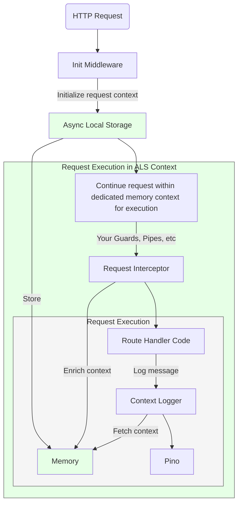

# nestjs-context-logger
<p align="center">
  <a href="https://nestjs.com/" target="blank"></a>
</p>
<p align="center">🌟 Request-scoped context logger for NestJS
<p align="center">
  <a href="https://www.npmjs.com/package/nestjs-context-logger" target="_blank"></a>
  <a href="https://www.npmjs.com/package/nestjs-context-logger" target="_blank"></a>
  <a href="https://www.npmjs.com/package/nestjs-context-logger" target="_blank"></a>
  <a href="https://medium.com/elementor-engineers/implement-contextual-logging-in-nestjs-using-asyncstorage-eb228bf00008" target="_blank"></a>
</p>


> 🔍 Ever tried debugging a production issue with logs like `"Error updating user"` but no context about which user, service, or request caused it? **This logger is your solution.** 

## [nestjs-context-logger](https://github.com/AdirD/nestjs-context-logger)
is a contextual logging solution for NestJS applications that enables you to enrich your logs with custom context, whenever and wherever you want in NestJS request execution lifecycle.


```typescript
// Traditional logging 😢
logger.error('Failed to update user subscription');
// Output: {"level":"error","message":"Failed to update user subscription"}

// With nestjs-context-logger 🎉
logger.error('Failed to update user subscription');
// Output: {
//   "level":"error",
//   "message":"Failed to update user subscription",
//   "correlationId":"d4c3f2b1-a5e6-4c3d-8b9a-1c2d3e4f5g6h",
//   "userId":"user_456",
//   "subscriptionTier":"premium",
//   "service":"SubscriptionService",
//   "requestPath":"/api/subscriptions/update",
//   "duration": 432,
//   "timestamp":"2024-01-01T12:00:00Z"
// }
```


## Installation

```bash
npm install nestjs-context-logger
```

## Quick Start

```typescript
// app.module.ts
import { ContextLoggerModule } from 'nestjs-context-logger';

@Module({
  imports: [
    ContextLoggerModule.forRoot()
  ],
})
export class AppModule {}
```

That's it! Your logs will automatically include the default context of `correlationId` and `duration`.


## Why nestjs-context-logger?
[](https://medium.com/elementor-engineers/implement-contextual-logging-in-nestjs-using-asyncstorage-eb228bf00008)
- 🎯 **Developer experience**: Easy to use, zero code changes required, keep using the familiar `@nestjs/common` logger interface.
- ⚡ **High Performance**: Built on Pino, one of the fastest loggers in the Node.js ecosystem
- 📊 **Default Context**: Automatically enriches request with `correlationId` and `duration`
- 🚀 **Platform agnostic**: works with `Express` and `Fastify`
- ✅ **Automatic context cleanup**: Memory is cleaned up and garbage collected when request cycle ends


## Advanced Configuration

### Automatic context enrichment via configuration

You can enrich your logs with custom context at the application level:

```typescript
@Module({
  imports: [
    ContextLoggerModule.forRootAsync({
        imports: [ConfigModule],
        inject: [ConfigService],
        useFactory: (configService: ConfigService) => ({
          pinoHttp: {
            level: configService.get('LOG_LEVEL'),
          },
            // enrichContext intercepts requests and allows you to enrich the context
            enrichContext: async (context: ExecutionContext) => ({
                userId: context.switchToHttp().getRequest().user?.id,
                tenantId: context.switchToHttp().getRequest().headers['x-tenant-id'],
                environment: configService.get('NODE_ENV'),
            }),
        }),
    });
  ],
})
export class AppModule {}
```

Now every log will include these additional fields:
```typescript
// Output: {
//   "message": "Some log message",
//   "userId": "user_123",
//   "tenantId": "tenant_456",
//   "environment": "production",
//   ...other default fields
// }
```

### Add custom context from anywhere
Update context from anywhere in the code 🎉. The context persists throughout the entire request execution, making it available to all services and handlers within that request.

For example, set up user context in a guard:

```typescript
@Injectable()
export class ConnectAuthGuard implements CanActivate {
  private readonly logger = new ContextLogger(ConnectAuthGuard.name);

  async canActivate(context: ExecutionContext): Promise<boolean> {
    const request = context.switchToHttp().getRequest();
    const connectedUser = await this.authenticate(request);
    // 👇 Magic here 👇
    ContextLogger.updateContext({ userId: connectedUser.userId });
    return true;
  }
}
```

The context flows through your entire request chain:

```typescript
@Injectable()
export class PaymentService {
  private readonly logger = new ContextLogger(PaymentService.name);

  async processPayment(paymentData: PaymentDto) {
    this.logger.updateContext({ tier: 'premium' });
    this.logger.info('Processing payment');
    // Output: {
    //   "message": "Processing payment",
    //   "userId": "user_123",  // From AuthGuard
    //   "tier": "premium",     // Added here
    //   ...other context
    // }

    await this.featureService.checkFeatures();
  }
}

@Injectable()
export class FeatureService {
  private readonly logger = new ContextLogger(FeatureService.name);

  async checkFeatures() {
    this.logger.info('Checking features');
    // Output: {
    //   "message": "Checking features",
    //   "userId": "user_123",  // Still here from AuthGuard
    //   "tier": "premium",     // Still here from PaymentService
    //   ...other context
    // }
  }
}
```


---

## How does it work?

Under the hood, `nestjs-context-logger` leverages Node.js's `AsyncLocalStorage` to maintain isolated context for each request.

### Storage Layer
- Uses Node.js's built-in `AsyncLocalStorage` for context isolation
- Each request gets its own isolated storage "bucket" that persists throughout the entire request lifecycle
- The storage is tied to the Node.js event loop and automatically cleans up when the request ends

### Request Lifecycle
1. **Context Initialization**
   - The `InitContextMiddleware` creates a new storage scope for each incoming request with a generated `correlationId`

2. **Context Propagation**
   - The context automatically flows through async operations (promises, callbacks)
   - No matter how deep your call stack goes, the context remains accessible
   - Each request maintains its own isolated context, even during concurrent requests

3. **Request Lifecycle**



### Memory Management
- Context is stored in memory only for the duration of the request
- **Automatic garbage collection when request ends (no memory leaks)**
- Each request's context is completely isolated from others
- No cross-request contamination, even under high concurrency


## Features in Depth

### 🔄 Automatic Context Injection
- Correlation ID
- Service Name
- Request Duration
- Name, Host, PID

### 🎯 Developer Experience
- Typed Logger (Finally!)
- Familiar NestJS logger interface (Same as `@nestjs/common` default experience)
- Context Isolation via middleware
- Global Request Interceptor for enriching context 

### ⚡ Performance
- Built on [Pino](https://github.com/pinojs/pino) for high-performance logging
- Efficient context storage with `async_hooks` [AsyncLocalStorage](https://nodejs.org/api/async_hooks.html)
- Minimal overhead compared to standard logging

### 🔌 Integration Support (Platform Agnostic)
- [Fastify](https://fastify.dev/) compatible
- [Express](https://expressjs.com/) compatible

## Configuration Options

| Option | Type | Default | Description |
|--------|------|---------|-------------|
| `logLevel` | string | 'info' | Log level (debug, info, warn, error) |
| `enrichContext` | Function | ```{ duration }``` | Custom context provider |
| `exclude` | string[] | [] | Endpoints to exclude from logging |

## API Reference


## Best Practices

1. **Use Semantic Log Levels**
   ```typescript
   // Good
   logger.debug('Processing started', { itemCount: 42 });
   logger.error('Failed to connect to database', error);

   // Not so good
   logger.log('Something happened');
   ```

2. **Add Contextual Data**
   ```typescript
   // Good
   logger.log('Order processed', {
     orderId: order.id,
     amount: order.total,
     items: order.items.length
   });

   // Not so good
   logger.log('Order processed');
   ```

3. **Prefer Structured Logging**
   ```typescript
   // Good
   logger.info('Item fetched', { id: '1', time: 2000, source: 'serviceA' });

   // Not so good
   logger.info('Item fetched id: 1, time: 2000, source: serviceA');
   ```

## Performance Considerations

This logger uses `AsyncLocalStorage` to maintain context, which does add an overhead.
It's worth noting that `nestjs-pino` already uses local storage [under the hood](https://github.com/iamolegga/nestjs-pino/blob/01fc6739136bb9c1df0f5669f998bbabd82b2a1a/src/storage.ts#L9) for the "name", "host", "pid" metadata it attaches to every request.

Our benchmarks showed a 20-40% increase compared to raw Pino, such that if Pino average is 114ms, then with ALS it's up to 136.8ms. This is a notable overhead, but still significantly faster than Winston or Bunyan. For reference, see Pino's [benchmarks](https://github.com/pinojs/pino/blob/main/docs/benchmarks.md).

While you should consider this overhead for your own application, do remember that the logging is non-blocking, and should not impact service latency, while the benefits of having context in your logs is a game changer.

## Resources (Coming Soon)

- 📘 Documentation
- 🎓 Best Practices Guide
- 📊 Performance Benchmarks
- 🔧 Configuration Guide

## Contributing

Contributions welcome! Read our [contributing guidelines](CONTRIBUTING.md) to get started.

## Support

- 🐛 [Issue Tracker](https://github.com/AdirD/nestjs-context-logger/issues)
- 💬 [Discussions](https://github.com/AdirD/nestjs-context-logger/discussions)

## License

MIT

---

Keywords: nestjs logger, pino logger, fastify logging, nestjs logging, correlation id, request context, microservices logging, structured logging, context logging, distributed tracing, nodejs logging, typescript logger, async context, request tracking
