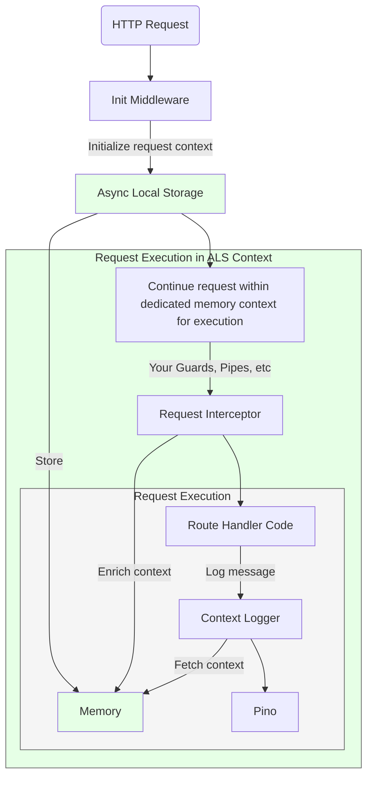

<p align="center">
  <a href="https://nestjs.com/" target="blank"></a>
</p>
<div align="center">
<h1 style="font-size: 2em;">NestJS Context Logger</h1>

[](https://badge.fury.io/js/nestjs-context-logger)
<a href="https://www.npmjs.com/package/nestjs-context-logger" target="_blank"></a>
<a href="https://medium.com/elementor-engineers/implement-contextual-logging-in-nestjs-using-asyncstorage-eb228bf00008" target="_blank"></a>
[](https://opensource.org/licenses/MIT)

🌟 A contextual logger for NestJS applications. 🌟
Enrich your logs with custom context, whenever and wherever you want in your request lifecycle.

[Quick Start](#quick-start) •
[API Reference](#api-reference) •
[Best Practices](#best-practices) •
[FAQ](#faq) •
[Contributing](#contributing) •
[License](#license)
</div>


> 🔍 Ever tried debugging a production issue with logs like `"Error updating user"` but no context about which user, service, or request caused it? **This logger is your solution.** 

# Overview
nestjs-context-logger is a structured, contextual, logging solution for NestJS applications that enables you to enrich your logs with custom context, whenever and wherever you want in NestJS request execution lifecycle.


```typescript
// Traditional logging 😢
logger.error('Failed to update user subscription');
// Output: {"level":"error","message":"Failed to update user subscription"}

// With nestjs-context-logger 🎉
logger.error('Failed to update user subscription');
// Output: {
//   "level":"error",
//   "message":"Failed to update user subscription",
//   "correlationId":"d4c3f2b1-a5e6-4c3d-8b9a-1c2d3e4f5g6h",
//   "userId":"user_456",
//   "subscriptionTier":"premium",
//   "service":"SubscriptionService",
//   "requestPath":"/api/subscriptions/update",
//   "duration": 432,
//   "timestamp":"2024-01-01T12:00:00Z"
// }
```


# Installation

```bash
npm install nestjs-context-logger
```

# Quick Start

```typescript
// app.module.ts
import { ContextLoggerModule } from 'nestjs-context-logger';

@Module({
  imports: [
    ContextLoggerModule.forRoot()
  ],
})
export class AppModule {}
```

That's it! Your logs will automatically include the default context of `correlationId` and `duration`.


# Why nestjs-context-logger?
[](https://medium.com/elementor-engineers/implement-contextual-logging-in-nestjs-using-asyncstorage-eb228bf00008)
- 🎯 **Developer experience**: Easy to use, zero code changes required, keep using the familiar `@nestjs/common` logger interface.
- ⚡ **High Performance**: Built on Pino, one of the fastest loggers in the Node.js ecosystem
- 📊 **Default Context**: Automatically enriches request with `correlationId` and `duration`
- 🚀 **Platform agnostic**: works with `Express` and `Fastify`
- ✅ **Automatic context cleanup**: Memory is cleaned up and garbage collected when request cycle ends


# Advanced Configuration

## Automatic context enrichment via configuration

You can enrich your logs with custom context at the application level:

```typescript
@Module({
  imports: [
    ContextLoggerModule.forRootAsync({
        imports: [ConfigModule],
        inject: [ConfigService],
        useFactory: (configService: ConfigService) => ({
          pinoHttp: {
            level: configService.get('LOG_LEVEL'),
          },
            // enrichContext intercepts requests and allows you to enrich the context
            enrichContext: async (context: ExecutionContext) => ({
                userId: context.switchToHttp().getRequest().user?.id,
                tenantId: context.switchToHttp().getRequest().headers['x-tenant-id'],
                environment: configService.get('NODE_ENV'),
            }),
        }),
    });
  ],
})
export class AppModule {}
```

Now every log will include these additional fields:
```typescript
// Output: {
//   "message": "Some log message",
//   "userId": "user_123",
//   "tenantId": "tenant_456",
//   "environment": "production",
//   ...other default fields
// }
```

## Log Field Grouping
You can group different types of log fields under specific keys, making logs more organized and easier to query:

```typescript
ContextLoggerModule.forRoot({
  groupFields: {
    bindingsKey: 'params',    // Groups runtime bindings
    contextKey: 'metadata'    // Groups context information
  }
})
```

Before grouping:
```json
{
  "userId": "123",           // context field
  "requestId": "abc",        // context field
  "correlationId": "xyz",    // binding
  "timestamp": "...",        // binding
  "level": "info",
  "msg": "User logged in"
}
```

After grouping:
```json
{
  "metadata": {              // grouped context
    "userId": "123",
    "requestId": "abc"
  },
  "params": {               // grouped bindings
    "correlationId": "xyz",
    "timestamp": "..."
  },
  "level": "info",
  "msg": "User logged in"
}
```

## Context Adaptation
Transform context data before logging to standardize format, remove sensitive data, or add computed fields:

```typescript
ContextLoggerModule.forRoot({
  contextAdapter: (context) => ({
    ...context,
    sensitive: undefined,           // Remove sensitive data
    requestId: context.reqId,      // Rename fields
    timestamp: Date.now()          // Add new fields
  })
})
```

## Bootstrap Logs Control
Control NestJS framework bootstrap logs to reduce noise during startup:

```typescript
ContextLoggerModule.forRoot({
  ignoreBootstrapLogs: true  // Suppress framework bootstrap logs
})
```

## Add custom context from anywhere
Update context from anywhere in the code 🎉. The context persists throughout the entire request execution, making it available to all services and handlers within that request.

For example, set up user context in a guard:

```typescript
@Injectable()
export class ConnectAuthGuard implements CanActivate {
  private readonly logger = new ContextLogger(ConnectAuthGuard.name);

  async canActivate(context: ExecutionContext): Promise<boolean> {
    const request = context.switchToHttp().getRequest();
    const connectedUser = await this.authenticate(request);
    // 👇 Magic here 👇
    ContextLogger.updateContext({ userId: connectedUser.userId });
    return true;
  }
}
```

The context flows through your entire request chain:

```typescript
@Injectable()
export class PaymentService {
  private readonly logger = new ContextLogger(PaymentService.name);

  async processPayment(paymentData: PaymentDto) {
    this.logger.updateContext({ tier: 'premium' });
    this.logger.info('Processing payment');
    // Output: {
    //   "message": "Processing payment",
    //   "userId": "user_123",  // From AuthGuard
    //   "tier": "premium",     // Added here
    //   ...other context
    // }

    await this.featureService.checkFeatures();
  }
}

@Injectable()
export class FeatureService {
  private readonly logger = new ContextLogger(FeatureService.name);

  async checkFeatures() {
    this.logger.info('Checking features');
    // Output: {
    //   "message": "Checking features",
    //   "userId": "user_123",  // Still here from AuthGuard
    //   "tier": "premium",     // Still here from PaymentService
    //   ...other context
    // }
  }
}
```


---

# How does it work?

Under the hood, `nestjs-context-logger` leverages Node.js's `AsyncLocalStorage` to maintain isolated context for each request.

## Storage Layer
- Uses Node.js's built-in `AsyncLocalStorage` for context isolation
- Each request gets its own isolated storage "bucket" that persists throughout the entire request lifecycle
- The storage is tied to the Node.js event loop and automatically cleans up when the request ends

## Request Lifecycle
1. **Context Initialization**
   - The `InitContextMiddleware` creates a new storage scope for each incoming request with a generated `correlationId`

2. **Context Propagation**
   - The context automatically flows through async operations (promises, callbacks)
   - No matter how deep your call stack goes, the context remains accessible
   - Each request maintains its own isolated context, even during concurrent requests

3. **Request Lifecycle**



## Memory Management
- Context is stored in memory only for the duration of the request
- **Automatic garbage collection when request ends (no memory leaks)**
- Each request's context is completely isolated from others
- No cross-request contamination, even under high concurrency


# Features in Depth

## 🔄 Automatic Context Injection
- Correlation ID
- Service Name
- Request Duration
- Name, Host, PID

## 🎯 Developer Experience
- Typed Logger (Finally!)
- Familiar NestJS logger interface (Same as `@nestjs/common` default experience)
- Context Isolation via middleware
- Global Request Interceptor for enriching context 

## ⚡ Performance
- Built on [Pino](https://github.com/pinojs/pino) for high-performance logging
- Efficient context storage with `async_hooks` [AsyncLocalStorage](https://nodejs.org/api/async_hooks.html)
- Minimal overhead compared to standard logging

## 🪝 Hooks
- Execute callbacks when logs are created
- Support for level-specific hooks (`log`, `debug`, `warn`, `error`)
- Global hooks that run for all log levels
- Useful for metrics, external reporting, or custom side effects

Example usage:
```typescript
ContextLoggerModule.forRoot({
  hooks: {
    // Run for all log levels
    all: [
      (message, bindings) => {
        metrics.increment('log.count');
      }
    ],
    // Run only for errors
    error: [
      (message, bindings) => {
        errorReporting.notify(message, bindings);
      }
    ]
  }
})
```

⚠️ Note: Hooks are executed synchronously and sequentially. Use with caution as they can introduce latency to the logging process.

## 🔌 Integration Support (Platform Agnostic)
- [Fastify](https://fastify.dev/) compatible
- [Express](https://expressjs.com/) compatible

# Configuration Options

| Option | Type | Default | Description |
|--------|------|---------|-------------|
| `logLevel` | string | 'info' | Log level (debug, info, warn, error) |
| `enrichContext` | Function | ```{ duration }``` | Custom context provider |
| `exclude` | string[] | [] | Endpoints to exclude from logging |
| `groupFields` | Object | undefined | Group log fields under specific keys |
| `contextAdapter` | Function | undefined | Transform context before logging |
| `ignoreBootstrapLogs` | boolean | false | Control framework bootstrap logs |
| `hooks` | Object | undefined | Callbacks to execute when logs are created |

# API Reference

## @WithContext Decorator

The `@WithContext` decorator enables context initialization for NestJS message patterns, event patterns, and cron jobs - anywhere you need logging context outside of HTTP requests.

### Import

```typescript
import { WithContext } from 'nestjs-context-logger';
```

### Basic Usage

```typescript
@Injectable()
export class UserService {
  private readonly logger = new ContextLogger(UserService.name);

  @WithContext()
  @MessagePattern('user.created')
  async handleUserCreated(data: CreateUserDto) {
    this.logger.log('Processing user creation'); 
    // Output: { "correlationId": "uuid-123", "message": "Processing user creation" }
  }

  @WithContext()
  @EventPattern('user.updated') 
  async handleUserUpdated(data: UpdateUserDto) {
    this.logger.log('User was updated');
    // Output: { "correlationId": "uuid-456", "message": "User was updated" }
  }

  @WithContext()
  @Cron('0 0 * * *')
  async dailyReport() {
    this.logger.log('Running daily report');
    // Output: { "correlationId": "uuid-789", "message": "Running daily report" }
  }
}
```

### Advanced Usage with Initial Context

You can provide initial context data that will be merged with the auto-generated `correlationId`:

```typescript
@Injectable()
export class PaymentService {
  private readonly logger = new ContextLogger(PaymentService.name);

  @WithContext({ 
    service: 'PaymentService',
    environment: process.env.NODE_ENV 
  })
  @MessagePattern('payment.process')
  async handlePayment(data: PaymentDto) {
    this.logger.log('Processing payment', { amount: data.amount });
    // Output: {
    //   "correlationId": "uuid-123",
    //   "service": "PaymentService", 
    //   "environment": "production",
    //   "amount": 100.50,
    //   "message": "Processing payment"
    // }
  }

  @WithContext({ jobType: 'cleanup' })
  @Cron(CronExpression.EVERY_HOUR)
  async cleanupExpiredSessions() {
    const count = await this.cleanupSessions();
    this.logger.log('Cleanup completed', { sessionsCleaned: count });
    // Output: {
    //   "correlationId": "uuid-456", 
    //   "jobType": "cleanup",
    //   "sessionsCleaned": 42,
    //   "message": "Cleanup completed"
    // }
  }
}
```

### Use Cases

**Message Patterns** - Perfect for microservice request-response handlers:
```typescript
@WithContext({ pattern: 'user.validate' })
@MessagePattern('user.validate')
async validateUser(@Payload() data: ValidateUserDto) {
  this.logger.log('Validating user credentials');
}
```

**Event Patterns** - Ideal for event-driven architecture:
```typescript  
@WithContext({ eventType: 'domain.event' })
@EventPattern('order.completed')
async onOrderCompleted(@Payload() event: OrderCompletedEvent) {
  this.logger.log('Order completion detected', { orderId: event.orderId });
}
```

**Cron Jobs** - Essential for scheduled task logging:
```typescript
@WithContext({ 
  task: 'data-sync',
  priority: 'high'
})
@Cron('0 2 * * *') // Every day at 2 AM
async syncUserData() {
  this.logger.log('Starting user data synchronization');
}
```

**Custom Handlers** - Works with any method that needs context:
```typescript
@WithContext({ operation: 'background-task' })
async processLargeDataset(data: any[]) {
  this.logger.log('Processing dataset', { itemCount: data.length });
  // Process data...
  this.logger.log('Dataset processing completed');
}
```

### Context Updates

Within decorated methods, you can update the context using `ContextLogger.updateContext()`:

```typescript
@WithContext({ service: 'EmailService' })
@MessagePattern('email.send')
async sendEmail(@Payload() emailData: EmailDto) {
  this.logger.log('Starting email send');
  
  // Update context with additional info
  ContextLogger.updateContext({ 
    recipientCount: emailData.recipients.length,
    template: emailData.template 
  });
  
  await this.deliveryService.send(emailData);
  this.logger.log('Email sent successfully');
  // All subsequent logs will include the updated context
}
```

### Benefits

- **Automatic Context Isolation**: Each decorated method execution gets its own context
- **Zero Configuration**: Works out of the box with sensible defaults
- **Flexible**: Supports any initial context data you need
- **Performance**: Minimal overhead using AsyncLocalStorage
- **Compatible**: Works with all NestJS patterns (@MessagePattern, @EventPattern, @Cron, etc.)

# Best Practices

1. **Use Semantic Log Levels**
   ```typescript
   // Good
   logger.debug('Processing started', { itemCount: 42 });
   logger.error('Failed to connect to database', error);

   // Not so good
   logger.log('Something happened');
   ```

2. **Add Contextual Data**
   ```typescript
   // Good
   logger.log('Order processed', {
     orderId: order.id,
     amount: order.total,
     items: order.items.length
   });

   // Not so good
   logger.log('Order processed');
   ```

3. **Prefer Structured Logging**
   ```typescript
   // Good
   logger.info('Item fetched', { id: '1', time: 2000, source: 'serviceA' });

   // Not so good
   logger.info('Item fetched id: 1, time: 2000, source: serviceA');
   ```

# Performance Considerations

This logger uses `AsyncLocalStorage` to maintain context, which does add an overhead.
It's worth noting that `nestjs-pino` already uses local storage [under the hood](https://github.com/iamolegga/nestjs-pino/blob/01fc6739136bb9c1df0f5669f998bbabd82b2a1a/src/storage.ts#L9) for the "name", "host", "pid" metadata it attaches to every request.

Our benchmarks showed a 20-40% increase compared to raw Pino, such that if Pino average is 114ms, then with ALS it's up to 136.8ms. This is a notable overhead, but still significantly faster than Winston or Bunyan. For reference, see Pino's [benchmarks](https://github.com/pinojs/pino/blob/main/docs/benchmarks.md).

While you should consider this overhead for your own application, do remember that the logging is non-blocking, and should not impact service latency, while the benefits of having context in your logs is a game changer.
You're right. Let me reorganize the FAQ to flow better, starting with potential issues, then explaining the ALS isolation mechanism, and finishing with Pino integration.

# FAQ for nestjs-context-logger

## Q: How does AsyncLocalStorage isolation work?

When you create a new AsyncLocalStorage instance, Node.js creates an isolated storage space:

```typescript
// Each new instance gets its own isolated storage space
const store1 = new AsyncLocalStorage<Record<string, any>>();
const store2 = new AsyncLocalStorage<Record<string, any>>();
```

This isolation is maintained at the Node.js runtime level, so when nestjs-context-logger creates its instance:
```typescript
// Inside nestjs-context-logger package
const globalStore = new AsyncLocalStorage<Record<string, any>>();
```

It's automatically isolated from any other ALS instances in:
- Your application code
- Other libraries (like nestjs-pino)
- Other parts of your system

This is why multiple packages can use ALS without conflict:
```typescript
// All of these work independently
yourAppStore.run({ tenant: 'abc' }, () => {
  pinoStore.run({ pid: 123 }, () => {
    contextLoggerStore.run({ userId: '456' }, () => {
      // Each store only sees its own context
    });
  });
});
```

## Q: How and when does AsyncLocalStorage clean up context?

ALS automatically cleans up when the execution context exits:

```typescript
// When this completes, context is eligible for garbage collection
ContextLogger.runWithCtx(async () => {
  await handleRequest();
  // After this, context is cleaned up
});
```

This happens:
- At the end of each request
- If an error occurs (context still gets cleaned up)
- When all async operations in the chain complete
- Even if you forget to clean up manually

## Q: How does nestjs-context-logger integrate with Pino?

nestjs-context-logger uses nestjs-pino under the hood, adding context management:

```typescript
@Module({
  imports: [
    ContextLoggerModule.forRoot({
      // Regular Pino options
      pinoHttp: {
        level: 'info',
        transport: {
          target: 'pino-pretty'
        }
      }
    })
  ]
})
```

The integration:
1. Uses Pino's high-performance logging engine
2. Preserves all Pino formatting and transport options
3. Adds context management through ALS
4. Automatically merges context into Pino's log output

Your logs get both Pino's performance and rich context:
```typescript
logger.info('User updated');
// Output includes both Pino's standard fields and your context:
// {
//   "level": "info",
//   "time": "2024-...",      // From Pino
//   "pid": 123,              // From Pino
//   "correlationId": "abc",  // From context-logger
//   "userId": "456",         // From your context
//   "message": "User updated"
// }
```

## Q: Can context be unavailable or lost?

Context can be lost in several scenarios:

1. Before ContextLoggerModule initialization:
```typescript
@Module({
  imports: [
    // ❌ Too early - logger not initialized yet
    OtherModule.forRoot({ 
      onModuleInit() {
        logger.info('Starting up');
      }
    }),
    
    // Logger module initialized after
    ContextLoggerModule.forRoot()
  ]
})
```

2. In background operations or timers:
```typescript
// ❌ Context lost - new execution context
setTimeout(() => {
  logger.info('Task done');  // No context available
}, 1000);

```
## Q: Why do my bootstrap logs look different than request logs?

During application startup, you might notice logs without context that look like this:
```
[Nest] 12345  - 12/08/2024, 2:43:09 PM     LOG [RouterExplorer] Mapped {/api/users, GET} route +0ms
[Nest] 12345  - 12/08/2024, 2:43:09 PM     LOG [RouterExplorer] Mapped {/api/users/:id, POST} route +0ms
[Nest] 12345  - 12/08/2024, 2:43:09 PM     LOG [RoutesResolver] UserController {/api/users}: +0ms
```

Instead of your normal contextual logs that look like this:
```json
{
  "level": "info",
  "time": "2024-12-08T14:43:09.123Z",
  "correlationId": "abc-123",
  "service": "UserService",
  "message": "Processing user request"
}
```

This happens because the NestJS bootstrap process is asynchronous:
1. Application starts & immediately begins logging
2. Modules initialize asynchronously, including ContextLoggerModule
3. Some logs will occur before ContextLoggerModule has a chance to set up its Pino instance
4. These early logs fall back to the default NestJS logger

These bootstrap logs are internal NestJS core component logs that happen during application setup - they don't need request context because there are no requests yet, and that it normal. However, if you want to pipe everything through a single logging system for consistency, you can do this:

```typescript
async function bootstrap() {
  const bootstrapLogger = new ContextLogger('Bootstrap');
  
  const app = await NestFactory.create(AppModule, {
    bufferLogs: true,
    logger: bootstrapLogger
  });

  await app.listen(3000);
}
```

# Testing
To mock logs for testing, we recommend automatically mocking the entire ContextLogger for all tests. You can achieve this by following these steps:

1. Create a Jest setup file:

```typescript
// jest/setupFile.ts
import 'jest-expect-message';

class MockContextLogger {
  public log() {
    return jest.fn();
  }
  public debug() {
    return jest.fn();
  }
  public warn() {
    return jest.fn();
  }
  public error() {
    return jest.fn();
  }
  public static getContext() {
    return {};
  }
  public static updateContext() {
    return jest.fn();
  }
}

jest.mock('nestjs-context-logger', () => {
  return { ContextLogger: MockContextLogger };
});
```

2. Configure Jest to use this setup file:
```json
// package.json
{
  "jest": {
    "setupFilesAfterEnv": [
      "jest-expect-message",
      "<rootDir>/../jest/setupFile.ts"
    ]
  }
}
```

3. Spy on the mocked `ContextLogger`

Now you can easily test logging in your services using spies:

```typescript
import { ContextLogger } from 'nestjs-context-logger';
import { UserService } from './user.service';

describe('UserService', () => {
  let service: UserService;
  let logErrorSpy: jest.SpyInstance;
  let logInfoSpy: jest.SpyInstance;

  beforeEach(async () => {
    logErrorSpy = jest.spyOn(ContextLogger.prototype, 'error');
    logInfoSpy = jest.spyOn(ContextLogger.prototype, 'info');
    service = new UserService();
  });

  it('should log user creation', async () => {
    await service.createUser({ email: 'test@example.com' });

    expect(logInfoSpy).toHaveBeenCalledWith(
      'User created',
      expect.objectContaining({ email: 'test@example.com' })
    );
  });

  it('should log errors', async () => {
    const error = new Error('Database error');
    await service.handleError(error);

    expect(logErrorSpy).toHaveBeenCalledWith(
      'Operation failed',
      error
    );
  });
});
```

# Contributing

Contributions welcome! Read our [contributing guidelines](CONTRIBUTING.md) to get started.

# Support

- 🐛 [Issue Tracker](https://github.com/AdirD/nestjs-context-logger/issues)
- 💬 [Discussions](https://github.com/AdirD/nestjs-context-logger/discussions)

# License

MIT

---

Keywords: nestjs logger, pino logger, fastify logging, nestjs logging, correlation id, request context, microservices logging, structured logging, context logging, distributed tracing, nodejs logging, typescript logger, async context, request tracking
